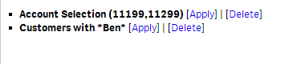
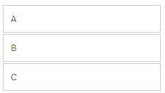
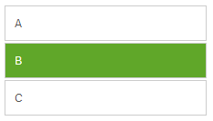
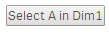

The directive wiAction allows you to add actions to any element (very similar to the concept of actions in QlikView 11).

## Basic Usage
You can add the `wi-action` directive to any Html-element, a `button`, a `div`, a link, etc.

***Example:***

    <ANY
		wi-action="back">
    </ANY>

***Result:***
If the user clicks on the element the last selection in the current app will be called.

## Multiple Actions
Multiple actions triggered by the same event can be defined by delimiting the actions with a semicolon (`;`).

    <ANY
		wi-action="field.selectAlternative('Dim1',true);field.lock('Dim1')">
    </ANY>

First select the alternatives in the field Dim1, then locks the selections in field Dim1. 

## Available Actions
The following actions are available:

### Selections

Action				| Description								
-----------			| -------------------------------
**`back`**			| Back to the last selection in the current app.
**`forward`**		| Next selection in the current app.
**`clearAll`**		| Clear all selections in the current app.
**`lockall`**		| Lock all selections in the current app.
**`unlockAll`**		| Unlock all selections in the current app.
**`selectValues`**	| Select values of the current object (see examples below)<br/><br/>**Parameters:**<br/> `dimNo` - Dimension index number (zero based)<br/>`values` - Array of value indices to select<br/>`toggleMode` - defines if toggling should be enabled (true by default).<br/><br/>**Example:**<br/> `wi-action="selectValues(0,0,true);"`<br/>`wi-action="selectValues(0,{{safe "{{row[0].qElemNumber}}" }},true);"` 

### Bookmarks

Action					| Description								
-----------------------	| -------------------------------
**`bookmark.apply`**	| Apply a bookmark.<br/><br/>**Parameter:**<br/>`id` - Id of the bookmark<br/><br/>**Example:**<br/>`wiAction="bookmark.apply('Xzraf')"`
**`bookmark.create`**	| Create a bookmark.<br/><br/>**Parameters:**<br/>`name` - Name of the bookmark<br/>`description` - Description of the bookmark.<br/><br/>**Example:**<br/>`wiAction="bookmark.create('My new Bookmark', 'This is the description.')"`
**`bookmark.remove`**	| Deletes a bookmark.<br/><br>**Parameter:**<br/>`id` - Id of the bookmark.<br/><br/>**Example:**<br/>`wiAction="bookmark.remove('ZwAkr')"`

### Field Methods
Action							| Description								
-------------------------------	| -------------------------------  
**`field.clear`**				| Clear a field selection.<br/><br/>**Parameter:**<br/>`name` - Name of the field<br/><br/>**Example:**<br/>`wi-action="field.clear('Dim1')"`
**`field.clearOther`**			| Clear all fields except the selected one.<br/><br/>**Parameter:**<br/>`name` - Name of the field<br/>`softlock` - If `true`, locked selections can be overridden.<br/><br/>**Example:**<br/>`wi-action="field.clearOther('Dim1', true)"`
**`field.lock`**				| Lock a field selection.<br/><br/>**Parameter:**<br/>`name` - Name of the field.<br/><br/>**Example:**<br/>`wi-action="field.lock('Dim1')"`
**`field.select`**				| Select field values.<br/><br/>**Parameters:**<br/>`name` - Name of the field<br/>`values` - Array of values to select<br/>`toggle` - Enable/disable toggling<br/>`softlock` - If `true`, locked selections can be overridden.<br/><br/>**Example:**<br/>`wi-action="field.select('Dim1', [1,2,3], true, false)"`
**`field.selectAll`**			| Select all values in a field.<br/><br/>**Parameters:**<br/>`name` - Name of the field<br/>`softlock` - If `true`, locked selections can be overridden.<br/><br/>**Example:**<br/>`wi-action="field.selectAll('Dim1', true)"`
**`field.selectAlternative`**	| Select alternative values in a field (***Bug in 0.96, not working***).<br/><br/>**Parameters:**<br/>`name` - Name of the field<br/>`softlock` - If `true`, locked selections can be overridden.<br/><br/>**Example:**<br/>`wi-action="field.selectAlternative('Dim1', true)"`	
**`field.selectExcluded`**		| Select excluded values in a field.<br/><br/>**Parameters:**<br/>`name` - Name of the field.<br/>`softlock` - If `true`, locked selections can be overridden.<br/><br/>**Example:**<br/>`wi-action="field.selectExcluded('Dim1', true)"`
**`field.selectMatch`**			| Select matching field values.<br/><br/>**Parameters:**<br/>`name` - Name of the field<br/>`match` - Match string<br/>`softlock` - If `true`, locked selections can be overridden.<br/><br/>**Examples:**<br/>`wi-action="field.selectMatch('Dim1', 'A', true)"`<br/>`wi-action="field.selectMatch('Customer', 'A*', true)"` 
**`field.selectPossible`**		| Select possible values in a field.<br/><br/>**Parameters:**<br/>`name` - Name of the field.<br/>`softlock` - If `true`, locked selections can be overridden.<br/><br/>**Example:**<br/>`wi-action="field.selectPossible('Dim1', true')"`
**`field.toggleSelect`**		| Toggle a field selection.<br/><br/>**Parameters:**<br/>`name` - Name of the field.<br/>`match` - Match string.<br/>`softlock` - If `true`, locked selections can be overridden.<br/><br/>**Example:**<br/>`wi-action="field.toggleSelect('Dim1', 'A', true)"`
**`field.unlock`**				| Unlock a field selection.<br/><br/>**Parameter:**<br/>`name` - Name of the field.<br/><br/>**Example:**<br/>`wi-action="field.unlock('Dim1')"`


### Navigation

Action					| Description								
-----------------------	| -------------------------------  
**`nextSheet`**			| Go to the next sheet
**`prevSheet`**			| Go to the previous sheet
**`gotoSheet`**			| Go to a sheet with the given Id<br/><br/>**Parameters:**<br/>`id` - Id of the sheet<br/><br/>**Example:**<br/>`wi-action="gotoSheet('zBIAzG')"`


### Variables
Action							| Description								
------------------------------	| -------------------------------  
**`variable.setContent`**		| Set the content of a variable.<br/><br/>**Parameters:**<br/>`name` -  Name of the variable<br/>`content` - New content of the variable<br/><br/>**Example:**<br/>`wi-action="variable.setContent('vVariable', 'myValue')"`
**`variable.create`**			| Create a variable<br/><br/>**Parameters:**<br/>`name` - Name of the variable<br/><br/>**Example:**<br/>`wi-action="variable.create('vNewVariable')"`


## Action Examples

### List as Bookmarks with Apply/Delete Link

***Html:***

```html
<wi-sys-info content="bookmarks">
    <ul class="wiList">
        <li ng-repeat="bookmark in bookmarks">
            <b>{{safe "{{bookmark.qData.title}}"}}</b>
            [<a href="javascript:void(0);" 
				wi-action="bookmark.apply('{{safe "{{bookmark.qInfo.qId}}"}}')">Apply</a>]
            | 
            [<a href="javascript:void(0);" 
				wi-action="bookmark.remove('{{safe "{{bookmark.qInfo.qId}}"}}')">Delete</a>]
            <br/>
        </li>
    </ul>
</wi-sys-info>
```

***Result:***



### Icon to Go to the Next sheet

***Html:***

```html
<i wi-action="nextSheet"
	class="fa fa-arrow-right fa-4x nextSheetIcon">
</i>
```

***Css:***

```css
.nextSheetIcon {
	color:#999;
	cursor:pointer;
}
```

***Result:***


### Selecting Values: Create a Simple Select-Box
This example demonstrates how to create a simple select-box.

***Data:***  
The typical sample-dataset (Ctrl+0+0) is assumed.  
*Dimension:* `Dim1`  

***Html:***  
Iterate through all values and display in boxes:

```html
<div class="selectBox" ng-repeat="row in layout.qHyperCube.qDataPages[0].qMatrix">
	<!-- Parameters for wiAction -->
	<!-- 1st: dimNo, so always 0 in this example -->
	<!-- 2nd: -->
	<!-- 3rd: 
    <div wi-action="selectValues(0,{{safe "{{row[0].qElemNumber}}" }},true)">
        {{safe "{{row[0].qText}}" }}
    </div>
</div>
```

***Css:***

```css
.selectBox {
    border: 1px solid #ccc;
    width:200px;
    padding:10px 10px 10px 10px;
    margin-top:2px;
    cursor:pointer;
}
.selectBox:hover {
    background-color:#60A729;
    color:#fff;
}
```

***Result:***

> 
(Default view)

> 
(Hovering over the fields)

### Select a Value Using a Button
This is just a very simple qWidget with a single button which select a hardcoded value in the dimension `Dim1`:

***Data:***  
The typical sample-dataset (Ctrl+0+0) is assumed.  
*Dimension:* `Dim1`  

***Html:***

```html
<button 
	wi-action="selectValues(0,{{safe "{{layout.qHyperCube.qDataPages[0].qMatrix[0][0].qElemNumber}}" }},true)">
    Select A in Dim1
</button>
```


***Result:***  
This selects the first item in Dim1 (according to the sort-rule).

> 