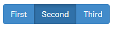
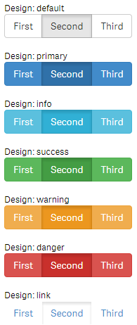
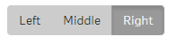

wiButtongroup allows you to define [Boostrap styled button-groups](http://getbootstrap.com/2.3.2/base-css.html#buttons) with single- or multiple-selections. If the user changes the selection, the result will be stored in a Qlik Sense variable.

## Basic Example

***Html:***

	<wi-buttongroup bind-qs-var="vOpt1">
	    <wi-radio-button label="First" value="'first'"></wi-radio-button>
	    <wi-radio-button label="Second" value="'second'"></wi-radio-button>
	    <wi-radio-button label="Third" value="'third'"></wi-radio-button>
	</wi-buttongroup>

***Result:***

The user can only select one of the buttons at the same time (like a Radio-Button), the result ('first', 'second' or 'third') will be stored to the Qlik Sense variable `vOpt1`.
`vOpt1` also defines the initial value of the button-group. 

## Properties

**Buttongroup**
The button-group is the container which holds either check-buttons or radio-buttons (don't mix check- and radio-buttons within a button-group).

* **`bind-qs-var`**  
The name of the variable the button should be bound to.  
*(Only applicable if you use wiRadiobuttons).*

**Radio-Buttons and CheckButtons**
These properties are available for both Radio-Buttons and Check-Buttons.

* **`label`**  
Label of the button.
* **`value`**  
Value which will be stored to the defined variable if the button is selected.
* **`design`**  
Default style for the button.  
Possible values are `default`, `primary`, `info`, `success`, `warning`, `danger`, `link`.  
(Defaults: `default`)

**Check-Buttons**
* **`bind-qs-var`**  
Name of the variable the button should be bound to.

## Designs
Depending on the property `design` a (according to the pre-defined styles of Bootstrap) design will be applied:

## Custom Styles
Custom styles can be defined as follows:

First instead of using one of the predefined design, define "custom" in the property `design`:

	<wi-check-button design="custom" ... />

By doing so the class `btn-custom` will be added to the button which can then be defined:

	/* Default Style */
	.btn-custom {
	    background-color:#ccc;
	    color:#333;
	}
	/* Hover Style */
	.btn-custom:hover {
	    color:#666;
	}
	/* Style for active/pressed button */
	.btn-custom.active {
	    background-color:#999;
	    color:#efefef;
	}

Result:

Full Code:

	<wi-buttongroup>
	    <wi-check-button design="custom" value="left" label="Left" bind-qs-var="vOpt1"/>
	    <wi-check-button design="custom" value="middle" label="Middle" bind-qs-var="vOpt2" />
	    <wi-check-button design="custom" value="right" label="Right" bind-qs-var="vOpt3" />
	</wi-buttongroup> 

