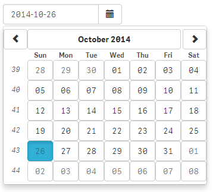
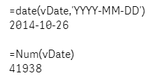
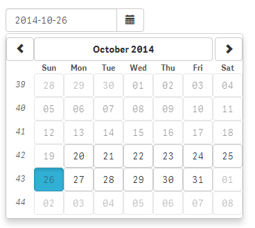

**`wiDatepicker`** is a very flexible date picker component to store a selected date into a variable in Qlik Sense.

## Basic Example

***Html:***

	<wi-datepicker 
	    bind-qs-var="vDate" 
	    popup="true">
	</wi-datepicker>

***Result:***

> 

## Properties
The following options are available to define the behavior of `wiDatepicker`:

* **`bind-qs-var`**  
Name of the variable the DatePicker should be bound to.
* **`popup`**  
Whether to display the DatePicker as popup.  
Default: true
* **`start-date`**  
Format: YYYY-MM-DD  
Example: start-date="2014-10-22"  
Default: current date  
* **`min-date`**  
Defines the minimum available date (all other dates are disabled).  
Format: see `start-date`
* **`max-date`**  
Defines the maximum available date (all other dates are disabled).  
Format: see `start-date`

## Using the Variable
The selected date value will be saved to the defined variable as date value.
(qWidget assigns the value by using Qlik Sense' function `makedate`):

Example how to format the assigned variable:  

## Examples

### Using all Properties

***Html:***

	<wi-datepicker 
	    bind-qs-var="vDate" 
		popup="true"
		min-date="2014-06-01"
		max-date="2014-12-01"
		>
	</wi-datepicker>

### Disabled Dates

***Html:***

	<wi-datepicker 
	    bind-qs-var="vDate" 
		popup="true"
		min-date="2014-10-20"
		max-date="2014-10-31"
		>
	</wi-datepicker>

***Result:***

> 

