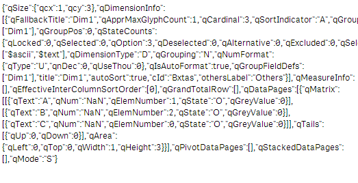
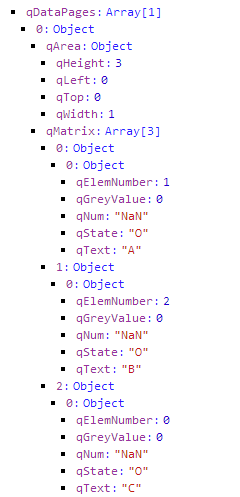

wiDebug is a little helper tool which allows you to review the object-structure of the current AngularJS scope easily.
This is especially useful while using typical data-binding functionality while creating qWidgets.

## Basic Usage

Instead of just typing `{{layout.qHyperCube}}` which returns you the following (which is incredibly hard to read:

> 

wiDebug lists you the content of layout in a more structured way (very similar to Chrome Web Developer Tools):

	<wi-debug object="layout.qHyperCube" />

### Result

> 

