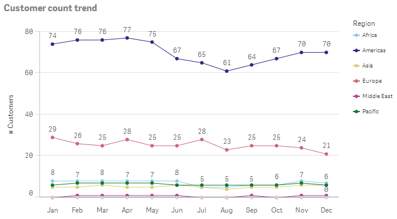
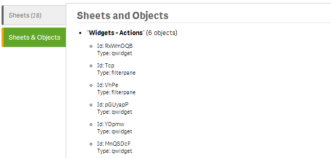
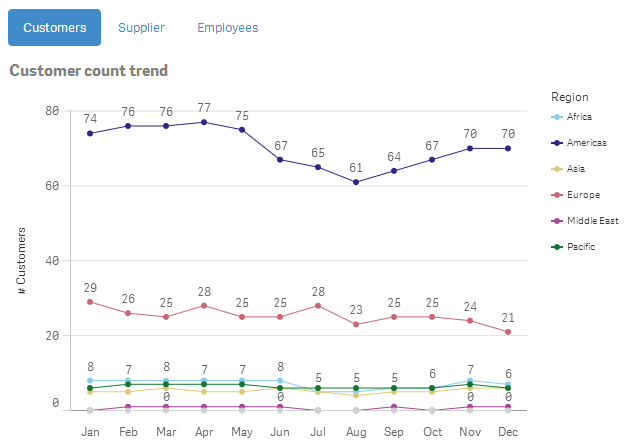
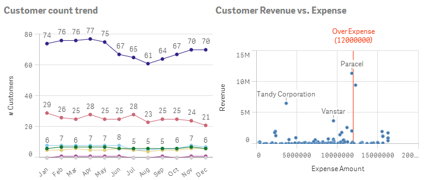
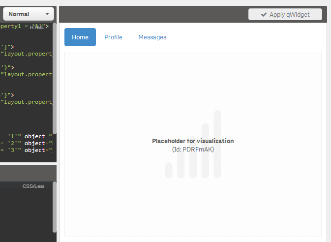

**`wiLinkedObject`** allows you to **embed existing objects** into your current sheet respectively into your qWidget.
    
## Basic Example

***Html:***

	<wi-linked-object object="PNPjjh" />

***Result:***

> 

## Linking Qlik Sense Objects

| Property					| Description
| :--------------------		| :--------------------------------------------------
| **`type`**				| Should be `qs` for embedding Qlik Sense objects.  ***Default:*** `type="qs"`
| **`object`**				| The object id.  ***Tip:*** For demonstration purposes you can also use `object="random"`, then any random object from the current app will be taken.

### Where to Place Objects?
While testing this approach the best practice seems to be to create an object, then add the object to the Visualizations Master Items. Then you can delete the object and just reference it in you qWidget.

### How to Retrieve Object IDs in Qlik Sense?

In Qlik Sense there is no way yet to retrieve the object id out of the box in the client.

Use one of the following work-arounds:

**Create a Bookmarklet:**
Create a bookmark in your browser and set the Url to

	javascript:(function(){(function foo(node){if(node&&node.$id){if(node.$$childHead)foo(node.$$childHead);if(node.$$nextSibling)foo(node.$$nextSibling);if(node.model&&node.model.layout)node.model.layout.title=node.model.id;}})(qvangularGlobal.$rootScope);pubsub.publish('/resize/end' )})()

This will create a "bookmarklet" that when clicked will **temporarily** display object ids instead of object titles.

**Use the Single Object Wizard:**
Use the wizard to [Single Object Wizard](http://localhost:4848/resources/single.html) to select a single object, the copy the Id from the end of the Url.

**Use wiSysInfo:**
Use wiSysInfo to display all objects in the current app:

	<wi-sys-info content="sheets" />

### Hiding/Showing Linked Object
If you want to hide and show several objects in a single qWidget use `ng-if` instead of `ng-hide`/`ng-show`

So this code example will work:

	

	    <a href="javascript:void(0);" ng-click="layout.property1 = 'obj1'">Show Object 1</a> | 
	    <a href="javascript:void(0);" ng-click="layout.property1 = 'obj2'">Show Object 2</a>
	

	
	

	
	

	    <wi-linked-object object="PNPjjh" />
	

	
	

	
	    <wi-linked-object object="GbaV" />
	
	

## Linking QlikView 11 Object

Not working yet!!!

| Property				| Description
| :--------------------	| --------------------------------------------------
| **`type`**			| Should be `qv` for QlikView 10, 11 and 11.2
| **`server`**			| To be documented
| **`usehttps`**		| To be documented
| **`document`**		| To be documented
| **`host`**			| To be documented
| **`object`**			| To be documented
| **`ticket`**			| To be documented
| **`bookmark`**		| To be documented
| **`selection`**		| To be documented

#### Example:

***Html:***

	<wi-linked-object 
	    type="qv-11" 
	    server="localhost"
	    usehttps="false"
	    document="Demos%2FCall%20Detail%20Record%20Analysis.qvw"
	    host="QVS%40demuc-swr02"
	    object="CH35"
	    ticket=""
	    bookmark=""
	    selection=""
	    >
	</wi-linked-object>

***Result:***

## Examples

### Example 1: Using Bootstrap-Tabs + Multiple-Objects

The objects always automatically resize (see `height` definition in `.qsObjects`).

***Html:***

	

	    

	        <ul class="nav nav-pills">
	          <li ng-class="{active: selectedTab == '1'}">
	            <a href="javascript:void(0);" qva-activate="selectedTab = '1'">Customers</a>
	          </li>
	          <li ng-class="{active: selectedTab == '2'}">
	            <a href="javascript:void(0);" qva-activate="selectedTab = '2'">Supplier</a>
	          </li>
	          <li ng-class="{active: selectedTab == '3'}">
	            <a href="javascript:void(0);" qva-activate="selectedTab = '3'">Employees</a>
	          </li>
	        </ul>
	    

	    

	        

	        

	        

	    

	

***Less:***

	.container {
	    height:100%;
	}
	.tab {
	    height:50px;
	}
	.qsObjects {
	    height:~"calc(100% - 50px)";
	    width:100%;
	}
	.qsObj {
	    height:100%;
	    width:100%;
	}

***Result:***

> 

### Example 2: Using Two Objects, Both With 50% Width

***Html:***

	

	    

	        <wi-linked-object object="PDRFmAK" class="qsObj">
	    

	    

	        <wi-linked-object object="HQpLKE" class="qsObj">
	    

	

***Css:***

	.container {
	    width:100%;
	    height:100%;
	}
	.col {
	    width:50%;
	    height:100%;
	    float:left;
	}
	.qsObj {
	    height:100%;
	}

***Result:***

> 

## Preview Not Shown in Edit-Mode
Due to performance reasons the requested visualization will not be shown in the qWidget Edit-Mode, instead a placeholder will be displayed:

> 

## Known Limitations

* QlikView 11 objects do not work properly in qWidget-EditMode, the editor will be frozen; you will not be able anymore to change your code (therefore deactivated as of now).