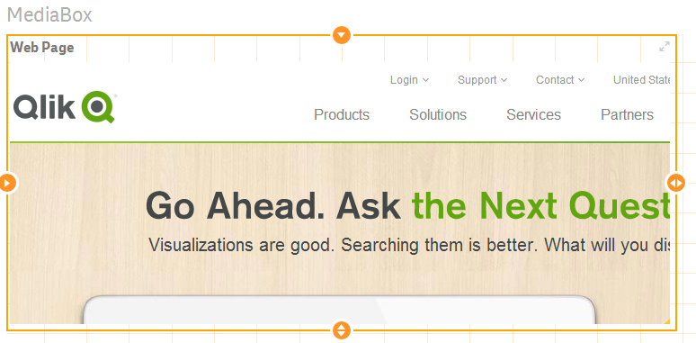

The Mediabox directive allows you to integrate several media-types into your dashboard:

- A Webpage
- A Video

Other media-types are possible (Html, Markdown, BB-Code, Images, etc.), let me know, if they are needed.

## Basic Example

	<wi-media-box
	    type="webpage"
	    url="http://www.qlik.com"
	    scrolling="no">    
	</wi-media-box>

results into

## Options

### General Options

| Property						| Type		| Description
| -----------------------------	| ---------	| ----------------------------------------------------
| **`type`**					| String	| Type of the MediaBox, can be one of the following types: **`webpage`**, **`video`**
| **`width`**					| Integer	| Width of the MediaBox, if not defined the width of the element will be taken. (Default: **`100%`**)
| **`height`**					| Integer	| Height of the MediaBox, if not defined the height of the element will be taken. (Default: **`100%`**)

### Type Webpage

| Property						| Type		| Description
| -------------					| ---------	| ----------------------------------------------------
| **`type`**					| String	| Should be **`webpage`**
| **`url`**						| String	| Url of the web page (including http:// or https://).
| **`scrolling`**				| String	| One of the following values:  **`auto`**: Scrollbars appear if needed (this is default) **`yes`**: Scrollbars are always shown (even if they are not needed) **`no`**: Scrollbars are never shown (even if they are needed)
| **`prevent-interaction`**		| Boolean	| If true the user will not be able to interact with the web page.  (Default: **`true`**)
| **`interaction-message`** 	| Boolean	| Defines whether the a message (defined in interaction-message-text) should displayed when the user tries to interact with the web page.  (Default: **`true`**)
| **`interaction-message-text`**| String	| Interaction Message.  (Default: **`'Interaction is disabled'`**)

### Type Video

Note: Type Video is still experimental.

| Property					| Type		| Description
| -------------				| ---------	| ----------------------------------------------------
| **`type`**				| String	| Should be **`video`**
| **`url`**					| String	| Url of the video, e.g. **`http://video-js.zencoder.com/oceans-clip.mp4`**
| **`autoplay`**			| Boolean	| If autoplay is true, the video will start playing as soon as page is loaded.  (Default: **`false`**)

Note: Additional options are to be added here ...

