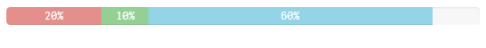

The wiProgressbar component has been created by leveraging the progressbar component of Boostrap: http://getbootstrap.com/components/#progress

Bootstrap style-definitions will be added automatically if you use `wi-progressbar`.

## Basic Example

***Html:***

```html
<wi-progressbar max="100" value="50">50%</wi-progressbar>
```

***Result:***

> 


## Properties

`wi-progressbar` is only available as an Html-element not as an attribute.

* **`max`**  
A number that specifies the total value of bars that is required.   
*(Default: 100)*
* **`value`**  
The current value of progress completed. 
* **`type`**  
Style type. Possible values are `primary`, `info`, `success`, `warning`, `danger`, `inverse`  
*(Default: null)*
* **`animate`**  
Whether bars use transitions to achieve the width change.  
*(Default: true)*

### Example Using All Properties

```html
<wi-progressbar 
	max="100" 
	value="50" 
	animate="true" 
	type="danger">50%
</wi-progressbar>
```

## Stacked Progressbar

If you want to add multiple bars into the same progressbar you can create a stacked progessbar:

### Basic Example

***Html:***
```html
<wi-progressbar>
    <progress>
        <bar value="20" type="danger">20%</bar>
        <bar value="10" type="success">10%</bar>
        <bar value="60" type="info">60%</bar>
    </progress>
</wi-progressbar>
```

***Result:***


> 

## Examples

### Types

Examples how a progressbar would look like depending on the chosen `type`:

> 


### Multiple Progressbars in a Single qWidget

***Html:***

```html
<!-- 
    Property definition for this example:
    ~~
    layout.property1: 100
    layout.property2: 30
    
    layout.property3: 20
    layout.property4: 10
    
    layout.property5: 50
-->
<wi-bootstrap>
    <div class="container-fluid">
        <div class="row">
            <wi-progressbar 
                max="layout.property1" 
                value="layout.property2" 
                type="success">{{layout.property2}}%
			</wi-progressbar>        
        </div>
        <div class="row">
            <wi-progressbar>
                <progress>
                    <bar value="layout.property3" type="danger">{{layout.property3}}%</bar>
                    <bar value="layout.property4" type="success">{{layout.property4}}%</bar>
                </progress>
            </wi-progressbar>
        </div>
        <div class="row">
            <wi-progressbar 
				max="100" 
				value="layout.property5">{{layout.property5}}%
			</wi-progressbar>
        </div>
    </div>
</wi-bootstrap>
```

***Result:***


> 


