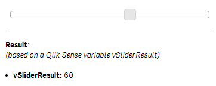
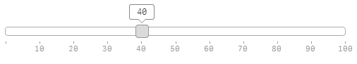

Use the wiSlider compoonent to manipulate the numeric values of one or two Qlik Sense variables with a graphical slider.

## Basic Example

***Html:***

	<wi-slider 
	    min="0" 
	    max="100"
	    step="10"
	    bind-qs-var="vSliderResult"
	    >
	</wi-slider>
	
	

	<b>Result</b>: 
	<i>(based on a Qlik Sense variable vSliderResult)</i>  
	
	<ui>
		<li><b>vSliderResult:</b> {{layout.property1}}</li>
	</ui>

***Property Definition:***
* layout.property1: `=vSliderResult`

***Result:***
The number result of the slider (any value between 0 and 100) will stored to the Qlik Sense variable `vSliderResult`.
To re-use this variable just use it in any expression (e.g. `=vSliderResult`).

> 

## Properties
The following options are available to define the behavior of `wiSlider`:

### General Properties

Property				| Description
-----------------------	| ------------------------------------------------------
`min`					| Minimum value (either integer or decimal). (Default: `0`)
`max`					| Maximum value (either integer or decimal). (Default: `100`)
`range`					| Enable/Disable a range of two values (`true`/`false`). (Default: `false`)
`orientation`			| Orientation of the slider. Either `horizontal` or `vertical`. (Default: `horizontal`)
`bind-local`			| Local scope variable to store the result into. (only applies if `range` is disabled)
`bind-local-min`		| Local scope variable to store the minimum-result into. (only applies if `range` is enabled)
`bind-local-max`		| Local scope variable to store the maximum-result into. (only applies if `range` is enabled)
`bind-qs-var`				| Name of a Qlik Sense variable to store the result into. (only applies if `range` is disabled)
`bind-qs-var-min`			| Name of a Qlik Sense variable to store the minimum-result into. (only applies if `range` is enabled)
`bind-qs-var-max`			| Name of a Qlik Sense variable to store the maximum-result into. (only applies if `range` is enabled)

### Ticks
The below listed properties can be used to define the behavior of the wiSlider's ticks.

> 

Property				| Description
-----------------------	| ------------------------------------------------------
`ticks`					| Enable or disable ticks. (Default: `true`)
`ticks-first`			| Behavior of the first tick.  **Possible Values:** `false` - First tick is not shown. `label` - The tick and the label will be rendered. `tick` - Only the tick will be rendered.
`ticks-last`			| Behavior of the last tick.
`ticks-rest`			| Behavior of all ticks except the first and last one.
`ticks-labels`			| Define the labels shown as array. Disable by leaving blank or setting `tick-labels="false"`  **Example:** `tick-labels="['Jan','Feb','Mar','Apr','May','Jun','Jul','Aug','Sep','Oct','Sep','Oct','Nov','Dec']"`  (Default: `false`)
`ticks-suffix`			| Suffix for the tick, e.g. `" USD"`. (Default: *blank*)
`ticks-prefix`			| Prefix for the tick, e.g. `"$ "`. (Default: *blank*)
`ticks-step`			| Numeric value to define the relative steps for the ticks, related ot the steps defined from the wiSlider steps. If step 1 is defined, for every step in the `step` property of `wiSlider` a tick will be rendered. (Default: *blank*)

### Hints
Use the below listed properties to influence the behavior of the hints when the user activates the slider:

> 

Property				| Description
-----------------------	| ------------------------------------------------------
`hints`					| Enable for disable hints. (Default: `true`)

### Initial Value(s)

* If Qlik Sense variables are defined (either `bind-qs` for a single value slider or `bind-qs-min` and `bind-qs-max` for range sliders), the values of these Qlik Sense variables will also be the initial values for the slider
* Otherwise a best-guess default value will be chosen.

## Style Modifications
The implementation of wiSlider is based on the [jQuery UI Slider](http://jqueryui.com/slider/). If you want to modify the style of the slider, add the following CSS definition to your qWidget:

***Css:***

	/* Default style */
	.wiSlider .ui-state-default {
	    border-color:blue;
	    background:lightblue;
	}

	/* Style when hovering a slider */
	.wiSlider .ui-state-hover {
	    background:darkblue;
	}

	/* Style when changing a slider */
	.wiSlider .ui-state-active {
	    background: red;
	}

## Examples

### Single Value Slider

	<wi-slider 
	    min="0" 
	    max="100"
	    step="10"
	    bind-qs-var="vSliderResult"
	    >
	</wi-slider>

### Range Slider

	<wi-slider 
	    min="0" 
	    max="100"
	    step="10"
		range="true"
	    bind-qs-var-min="vSliderResultMin"
		bind-qs-var-max="vSliderResultMax
	    >
	</wi-slider>

### Vertical Slider

	<wi-slider 
	    min="0" 
	    max="100"
	    step="10"
		orientation="vertical"
	    bind-qs-var="vSliderResult"
	    >
	</wi-slider>

### Set Height of a Vertical Slider

Use the inline style to define the height of a vertical slider.
Note: In the sense of responsiveness this is not an ideal solution!!!

	<wi-slider
	    min="0"
	    max="100"
	    range="true"
	    step="10"
	    orientation="vertical"
	    
	    ticks="true"
	    ticks-first="label"
	    ticks-last="label"
	    ticks-rest="label"
	    ticks-step="5"
	    
	    bind-qs-var-min="vSliderResultMin"
		bind-qs-var-max="vSliderResultMax

	    style="height:300px"
	    
	    >
	</wi-slider>

### Slider Using Decimal Values

Not supported, yet.

### Targeting Qlik Sense Variables

	<wi-slider 
	    min="0" 
	    max="100"
	    step="10"
		range="true"
	    bind-qs-var-min="vSliderResultMin"
		bind-qs-var-max="vSliderResultMax
	    >
	</wi-slider>

### Working with Local Variables

	<wi-slider 
	    min="0" 
	    max="100"
	    step="10"
		range="true"
	    bind-local-min="sliderMin"
		bind-local-max="sliderMax
	    >
	</wi-slider>

### Modified Style

## Known Issues
* Smaller rendering issues:
	* If you maximize the wiSlider, initially the hints will not be rendered correctly
	* The wiSlider is regarding its rendering sometimes not fully responsive
* If variables are updated (in the QIX Engine), wiSlider doesn't get updated automatically
* Hints are disabled if `orientation` is set to `vertical`
* Fixed sized vertical sliders are not responsive at all.

## Future Improvements
* Support for decimal numbers.

## Appendix
### How to Define Variables ?

As of Qlik Sense 1.0 you can create variables only in the load script:

	// Use only integer values as of now !
	SET vVariableName = 155;
