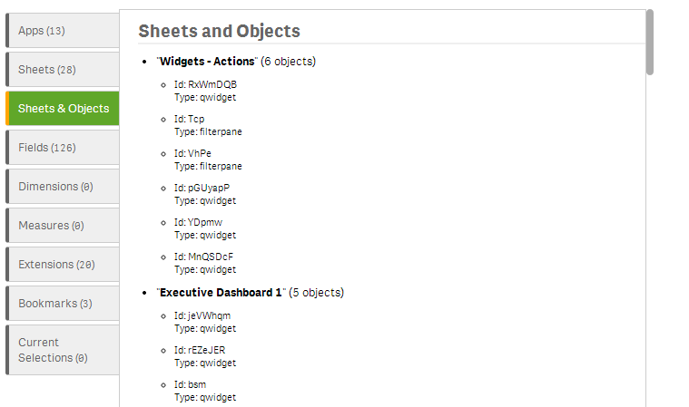
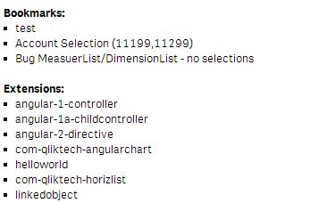
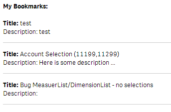
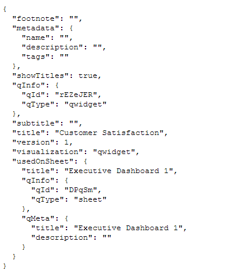

The main purpose of this component is to retrieve system meta information for supporting either the development process of qWidgets or to use them in your visualizations.

The following system meta information can be retrieved with `wiSysInfo`:
- A collection of all **apps**
- A collection of **sheets and objects (meta-data)** in the current app
- A collection of all **visualizations** in the current app
- A collection of all **dimensions/measures** in the current app
- A collection of all **Extensions** available
- A collection of all **Bookmarks**
- A collection of all **Current Selections**

## Basic Example - Default Visualization

If you use `wiSysInfo` without any of the below described options, you will get the following:

***Html:***

	<wi-sys-info />

***Result:***

## Basic Example - Custom Visualization

If you for example just want to retrieve the collection of **Bookmarks** and **Extensions** and use them in a simple visualization this could look as follows:

***Html:***

	<wi-sys-info content="bookmarks,extensions">
	    <b>Bookmarks:</b>
	    <ul class="myListStyle">
	        <li ng-repeat="bookmark in bookmarks">
	            {{bookmark.qData.title}}
	        </li>
	    </ul>
	    
	     
	    <b>Extensions:</b>
	    <ul class="myListStyle">
	        <li ng-repeat="extension in extensions">
	            {{extension}}
	        </li>
	    </ul>
	</wi-sys-info>

***CSS:***

	ul.myListStyle {
	    list-style-type:square;
	    list-style-position:inside;
	}

***Result:***

> 

## Use Cases
Some use-cases:

- Display a list of sheets with their Names & IDs
	- Use this list to create a custom navigation
- Display a list of visualizations in the library (with their internal IDs)

## Properties

| Name 				| Type 		| Description
| ---- 				| ---------	| ------------------------------------------------
| **`content`**		| Strings	| Comma separated list of desired objects.  **Default:** `empty`, will return the following object types: `'apps', 'sheets', 'fields', 'measures', 'dimensions', 'extensions', 'bookmarks', 'currentselections'` > **Possible Values:** `'apps'`, `'sheets'`, `'fields'`, `'measures'`, `'dimensions',` `'extensions'`, `'bookmarks'`, `'currentselections'`,`visualizations`

Note: `visualizations` is the slowest content type because detailed information for all objects in the app will be retrieved from the QIX Engine.

## How to Retrieve the Object's Properties

You are maybe asking yourself how to know all the possible properties in an object (and depending on the object the properties are different).

The answer is quite easy:
* Just use the qWidget-Editor and the qWidget-LivePreview to list all possible properties

Let's say you want to want to display the **Title** and **Description** of a bookmark:

First start with the rudimentary code:

	<wi-sys-info content="bookmarks">
	    
	</wi-sys-info>

Now let's display all available properties of the bookmark-collection:

	<wi-sys-info content="bookmarks">
	    

	        {{bookmark}}
	        

	    

	</wi-sys-info>

You will see the following in the qWidget-LivePreview:

> 

# Examples

## Retrieving all Visualizations + Filter

***Html:***

Retrieve all objects with containing the string "Customer".

	<wi-sys-info content="visualizations">
	    

	        <pre ng-bind="vis | json" />
	        

	    

	</wi-sys-info>

***Result:***

> 

So by changing our Html-code as follows:

	<h2>My Bookmarks:</h2>
	 
	<wi-sys-info content="bookmarks">
	    

	        <b>Title:</b> {{bookmark.qData.title}} 
	        </b>Description:</b> {{bookmark.qData.description}} 
	        

	    

	</wi-sys-info>

We will now retrieve the desired result:

> 

## Known Limitations

The content-types "`dimensions`" and "`measures`" do not work in 0.95 (see [http://community.qlik.com/thread/123518](http://community.qlik.com/thread/123518)).