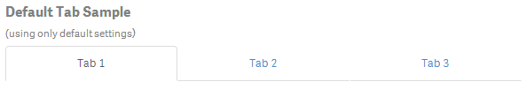
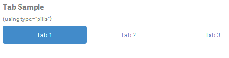

The tab-component is based on Bootstrap's tabs.

## Basic Example

***Html:***  

	<wi-tab>
	    <tabset>
	        <tab heading="Tab 1"></tab>
	        <tab heading="Tab 2"></tab>
	        <tab heading="Tab 3"></tab>
	    </tabset>
	</wi-tab>

***Result:***

> 

## Options

**Note:** There is ***no need*** to surround `wi-tab` with `wi-bootstrap`, the Boostrap will be automatically made available if you declare `wi-tab`! 

### tabset

Property			| Description
-------------------	| ---------------------------------------------------------
**`vertical`**		| Defines whether tabs appear vertically stacked.  *Defaults: false*
**`justified`**		| Defines whether tabs fill the container and have a consistent width.  *Defaults: false*
**`type`**			| Defines the navigation type. Possible values are '`tabs`' and '`pills`'  *Defaults: '`tabs`'*	

### tab

Property			| Description
-------------------	| ---------------------------------------------------------
**`heading`** or `<tab-heading>`	| Heading text or Html markup.
**`active`**		| Defines whether the tab is currently selected.  *Defaults: false*
**`disabled`**		| Defines whether the tab is clickable and can be activated.  *Defaults: false*
**`select()`**		| An optional expression called when tab is activated.
**`deselect()`**	| An optional expression called when tab is deactivated.

## More Examples

### Vertical Tab

### Type Pills

***Html:***

	<wi-tab>
	    <tabset type="pills">
	        <tab heading="Tab 1"></tab>
	        <tab heading="Tab 2"></tab>
	        <tab heading="Tab 3"></tab>
	    </tabset>
	</wi-tab>

***Result:***

> 

