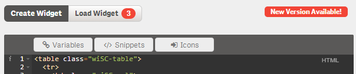

## Latest Qlik Sense 1.0 Build

* **Version 0.12.03**
* **Date:** 2014-10-22
* **Tested On:**
	* Qlik Sense Version: 1.0
	* Qlik Sense Server: 1.0
	* Browser: Chrome + Internet Explorer 11
* **Download:** [qWidget_0.12.03.zip](download/qWidget_0.12.03.zip)

-----

## Change Log

### Version 0.12.03
Date: 2014-10-22
* **Features / Improvements:**
    * Improved wi-sys-info ...
		* Added the ability to get the Master Objects with `wiSysInfo`
		* Added details to `measures`, `dimensions` and `masterobjects` in the default output of `wiSysInfo`
    * Enabled `wiAction` in `wiTab`
* **Bugfixes:**
	* Fixed a lot of errors in the documentation

### Version 0.12.01
Date: 2014-10-16  
* **Features:**
    * Improvements to `wiSysInfo`: Sheets are now returned in the correct order
    * Improvements to `wiAction`: `gotoSheet`, `nextSheet` & `prevSheet` work now much better (without a hard browser refresh)

### Version 0.12.0 
Date: 2014-10-13  
* **Features:**
    * New wiButtongroup component
* **Breaking Changes:**
    * Renamed wiSlider's property `bindQs` to `bindQsVar`
    * Renamed wiSlider's property `bindQsMin` to `bindQsVarMin`
    * Renamed wiSlider's property `bindQsMax` to `binQsVarMax`
    * Renamed wiSlider's property `type` to `design`
    * Renamed wiProgressbar's property `type` to `design`

### Version 0.11.03
Date: 2014-10-06
* **Bugfixes:**
    * Several minor bugfixes for Qlik Sense Server 1.0
    * On the Qlik Sense Server assets from local repository couldn't be loaded (.less is not an allowed media-type)
    * New qWidget couldn't be saved
    * Prevent calling the qWidget-Webservice in View-Mode

### Version 0.11.01
Date: 2014-09-22
* Several Bugfixes for Qlik Sense Server 1.0

### **Version 0.11.00**
* **Date:** 2014-09-04
* **Tested On:**
	* Qlik Sense Version: 0.97 (Build Nr. 634)
	* Qlik Sense Server: Should work on Qlik Sense Server (Build Nr. 634), but could unfortunately not test it, didn't get the server up and running ... ;-(
	* Browser: Chrome + Internet Explorer 11
* **Download:** [qWidget_0.11.00.zip](download/qWidget_0.11.00.zip)

### **Version 0.10.0**
Date: 2014-08-26
* **Tested On:**
	* Qlik Sense Version/Desktop: 0.96
	* QlikView.Next Server: 0.95
	* Browser: Chrome + Internet Explorer 11
* **Download:** [qWidget_0.10.00.zip](download/qWidget_0.10.00.zip)
* **New Features**:
	* **New Components**:
		* `wiProgressbar`
	* **Snippets**:
		* Snippets for adding a progressbar
		* Snippet for using the shorthand notation for binding to a HyperCube
	* **Documentation**
		* All changes described above
		* Rebuild documentation for allowing deep-linking to specific page

### Version 0.9.03
* **Date:** 2014-08-07
* **Tested On:**
	* Qlik Sense Version/Desktop: 0.96
	* QlikView.Next Server: 0.95
	* Browser: Chrome + Internet Explorer 11
* **Download:** [qWidget_0.9.03.zip](download/qWidget_0.9.03.zip)
* **New Features:**
	* New Components:
		* `wiSlider`
			* Manipulate one or two Qlik Sense variables with a slider
	* Component Improvements:
		* `wiSysInfo`
			* Returning the icon for the visualization (`visualizationTypeIcon`)
	* Documentation
		* All changes described above
	* Snippets
		* Sample snippets for `wiSlider`
* **Changes**
	* Better user experience when filtering qWidgets from a repository
* **Post-Build Fixes:**
	* 0.9.03: Added backwards compatibility for gotoSheet

### Version 0.8.00
* **Date:** 2014-08-04
* **Tested On:**
	* Qlik Sense Version/Desktop: 0.96
	* QlikView.Next Server: 0.95
	* Browser: Chrome + Internet Explorer 11
* **Download:** [qWidget_0.8.00.zip](download/qWidget_0.8.00.zip)
* **New Features:**
	* Enabled support for QlikView.Next Server 0.95

### Version 0.7.20 (0.7.19)
* **Date:** 2014-07-31
* **Qlik Sense Version:** 0.96 / Qlik Sense Desktop
* **Qlik Sense Server Support:** Not tested intensively, yet! **Will probably not work!!**
* **Browser:** Tested mainly in Chrome + Internet Explorer 11
* **Download:** [qWidget_0.7.20.zip](download/qWidget_0.7.20.zip)
* **New Features:**
	* New Components:
		* `wiDebug` - List the available object tree more easily
		* `wiTab` - To create Boostrap based tab container.
	* Component Improvements:
		* `wi-sys-info` offers a new content type `visualizations` to retrieve all visualizations in the current app
		* `wi-minichart` can now also be used as an attribute.
		* `wi-bootstrap` can now also be used as an element.
		* `wi-bootstrap` is not an experimental feature anymore.
		* `wi-action`:
			* Multiple actions for the same event are now possible (separated with a semicolon)
			* New action `field.selectAll`
			* New action `field.select`
	* New **IMPORTANT** addition to the Shorthand Notation when working with HyperCubes
		* `wi.colHeaders()`
	* Ability to change the font-size in the editors (mainly meant for demonstrating qWidget using a projector)
* **Bugfixes:**
	* `wi-linked-object`
		* 100% Rewritten 
		* Will be redrawn automatically if the screen size changes
		* Removed property height and width, can now be done with 100% pure CSS
		* Solved performance issues in qWidget Edit-Mode
		* Added two advanced examples in the documentation
	* v0.7.20: in v0.7.19 the Publish dialog remains empty
* **Documentation**
	* All new features/changes/bugfixes mentioned above
	* Updated roadmap
* **New Code-Snippets**
	* Some `wiTab` samples

### Version: 0.6.6
* **Date:** 2014-07-14
* **QlikView.Next Version:** 0.95/0.96
* **Browser:** Tested mainly in Chrome + Internet Explorer 11
* **Download:** [qWidget_0.6.6.zip](download/qWidget_0.6.6.zip)
* **New Features:**
	* New Actions:
		* `variable.create`
		* `variable.setContent`
		* `field.clear`
		* `field.clearOther`
		* `field.lock`
		* `field.selectAlternative`
		* `field.selectExcluded`
		* `field.selectMatch`
		* `field.selectPossible`
		* `field.toggleSelect`
		* `field.unlock`
	* New Component:
		* `wiBootstrap` - Include Bootstrap in your qWidget (**experimental**)
* **Optimizations:**
	* Annotations are disabled in the Html- & CSS/Less-Editor (=> better performance)
* **Changes:**
	* **wiLinkedObject**: `type` is now `qs` by default 
* **Bugfixes:**
	* **wiLinkedObject**: Prevent self-referencing

### Version: 0.5.1
* **Date:** 2014-07-06
* **QlikView.Next Version:** 0.95/0.96
* **Browser:** Tested mainly in Chrome + Internet Explorer 11
* **Download:** [qWidget_0.5.1.zip](download/qWidget_0.5.1.zip)
* **New Features:**
	* Added several new actions to wiAction (see documentation):
		* `gotoSheet`
		* `bookmark.create`
		* `bookmark.apply`
		* `bookmark.delete`
	* Tested and enabled for Qlik Sense Desktop (tested with version 0.96)

### Version: 0.4.15
* **Date:** 2014-07-03
* **QlikView.Next Version:** 0.95
* **Browser:** Tested mainly in Chrome & Internet Explorer 11
* **Bugfixes:**
	* Fixed a major issue with styles (styles disappeared in qWidget-NormalView after some selections have been made in the document)
	* Some minor performance improvements

### Version 0.4.13
* **Date:** 2014-07-03
* **QlikView.Next Version:** 0.95
* **Browser:** Tested mainly in Chrome & Internet Explorer 11
* **New Features:**
	* Tested with Internet Explorer 11
	* Works now for both QlikView.Next 0.90 and Qlik Sense Desktop 1.0 (0.96)
	* Component **`wiLinkedObject`** to embed existing objects into your qWidget
	* Component **`wiSysInfo`** to retrieve system meta data from the QIX engine (like a list of apps, sheets, objects, bookmarks, etc.)
* **Documentation:**
	* Documentation for `wiLinkedObject`
	* Documentation for `wiSysInfo`
* **New Snippets:**
	* "Working with HyperCubes: Shorthand Notation Examples"
* **Bug Fixes:**
	* Major performance improvements
	* Fixed memory leak in qWidget-Editor when working either a long time or with large Html/Css code-blocks
* **Breaking Changes:**
	* Doesn't work anymore for QlikView.Next Personal Edition 0.9 (existing qWidgets from 0.9 will continue to work though)

### Version 0.3.1
* **Date:** 2014-06-25
* **QlikView.Next Version:** 0.95
* **Browser:** Tested mainly in Chrome

### Version 0.2.0
* Date: 2014-06-22
* QlikView.Next Version: 0.90
* * New Features:
	* **MediaBox** Directive for integrating web-pages and videos
* Documentation:
	* New Page: Getting Started > Positioning
		* General Positioning
		* Why JavaScript is not allowed in qWidgets
	* MediaBox Directive documentation
* Download: [qWidget_0.2.0.zip](download/qWidget_0.2.0.zip)

### Version 0.1.1
* Date: 2014-06-20
* QlikView.Next Version: 0.90
* Improvements:
	* Reduced loading-time by about 25%

### Version 0.1.0
* Date: 2014-06-19 
* Internal Alpha

## About Versioning
### Semantic Versioning
qWidget uses Semantic Versioning: http://semver.org/

### New Version Notification
If you are connected to the Qlik-intranet (either directly or via VPN) the extension will automatically check if there are updates available and display the following indicator if there is a newer version available:

This only applies to major updates, of e.g. if 0.2.0 is published instead of 0.1.0, you will not get a notification for minor updates like from 0.1.40 to 0.1.41.
