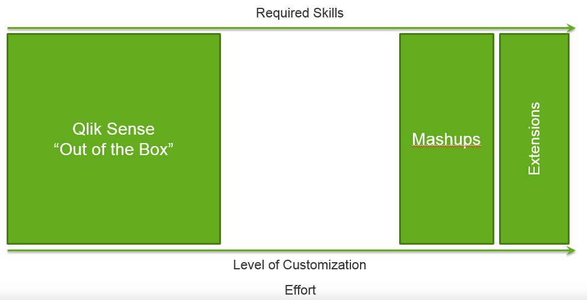
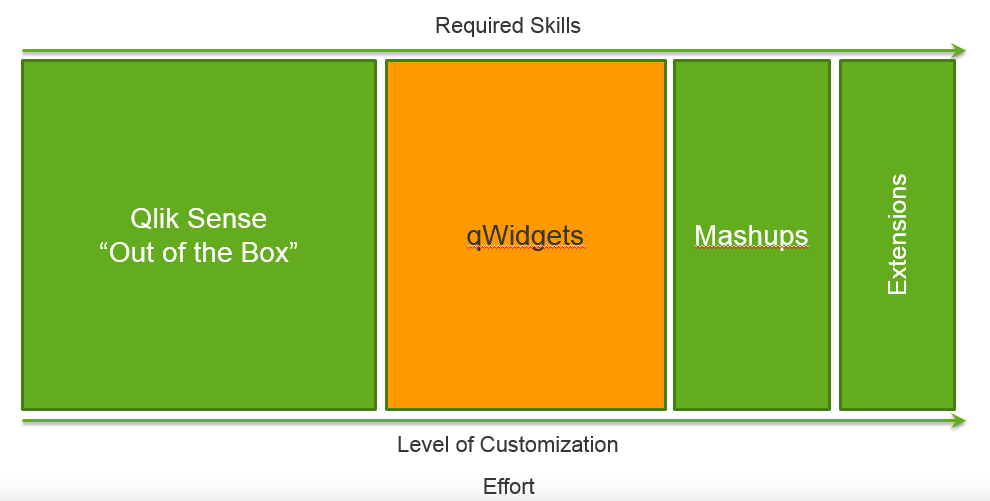
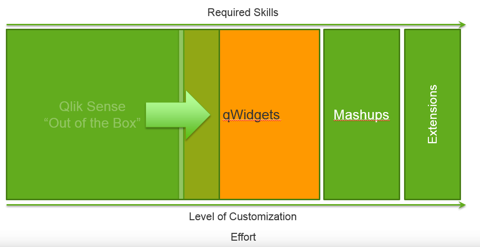
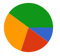

## Why having qWidget, Mashups & Extensions ?
You maybe ask yourself how the concept of qWidget fits into the strategy of Qlik Sense?

Here is my PERSONAL opinion on this question:

Qlik Sense offers great functionality for Business Users that they can create their own dashboard in a **Self Service approach** adding objects by just drag & drop them onto a sheet.

If one wants to create special visualizations you have two options, either developing them using the **Extensions** concept (which requires a quite robust understanding of JavaScript) or creating **Mashups**:

**Mashups** are absolutely great and the new Mashup-Editor in Qlik Sense makes it quite easy to create Mashups, but Mashups live outside the Qlik Sense Client, they are great for creating web-pages, intranet-pages and integrating Qlik Sense visualizations into portals.

But what happens if you want to create really customized dashboards **inside** the Qlik Sense Client?

This is the requirement where IMHO qWidget comes into play:

But using the qWidget concept you can:

* Create new visualization by just using Html & CSS
* Bring a lot of the web's functionality into Qlik Sense
* Create completely new visualizations in just minutes
* Re-Use visualizations across apps and even environments 

Certainly, over time and with new features in Qlik Sense the "Out of the Box" of Qlik Sense functionality will be enriched, so the following will happen:

## Why not Allowing JavaScript in qWidget ?
You may ask yourself why it is not allowed to load additional JavaScript libraries in qWidget.

There are several reasons why I have explicitly decided NOT to allow JavaScript or additional libraries in a qWidget:

* If you are a JavaScript developer you are probably fine just using Qlik Sense's APIs and develop your own extension
* qWidgets should be secure
* By leveraging the power of AngularJS you can achieve quite a lot you would normally do in JavaScript (data-binding, implement display logic, etc.)

### The Component Approach
Instead of allowing JavaScript in qWidgets I think that the more robust way is to extend the default capabilities of Html/CSS/Less + AngularJS with COMPONENTS.

As of now components in qWidget are technically spoken Angular-Directives and extend the functionality of standard Html. There are already some components available, for example the `wi-minichart` component, which makes it easy to integrate mini-charts into a qWidget:

	<wi-minichart 
	    data='1,2,3,4' 
	    type='pie'
	    height='100px'>
	</wi-minichart>

results into:

### qWidget Components
For the **near future** it is the plan to add additional components to qWidget, e.g.:

* Mediabox for integrating images, web-pages, videos, etc.
* Navigational components like Tabs, Accordions, Menus, etc.
* Some additional chart-types which are not available in Qlik Sense out of the box

All these components are realized using the AngularJS' concept of Directives which makes it easy to 
* Re-Use also existing JavaScript libraries like D3
* Or just re-use powerful existing directives like [AngularJS-UI](http://angular-ui.github.io/)

### Web Components
In the long run qWidget could and will probably just support the concept of **Web Components**, which is in my opinion the way how the web will evolve in the next years.
Some interesting articles

* Good Video: ["Web Components: A Tectonic Shift for Web Development"](https://developers.google.com/events/io/sessions/318907648)
* [Google Believes Web Components Are The Future Of Web Development](http://techcrunch.com/2013/05/19/google-believes-web-components-are-the-future-of-web-development/)
* [Google's Polymer project](http://www.polymer-project.org/) (based on the idea of web components)
* [Polymer UI Elements](http://www.polymer-project.org/docs/elements/polymer-ui-elements.html) (prototypes)
* [Google & the AngularJS team about the future of Polymer, Web-Components & AngularJS](http://www.2ality.com/2013/05/web-components-angular-ember.html)

AngularJS and Web Components are very compatible, so it will be quite easy to bring these two approaches together.