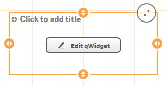
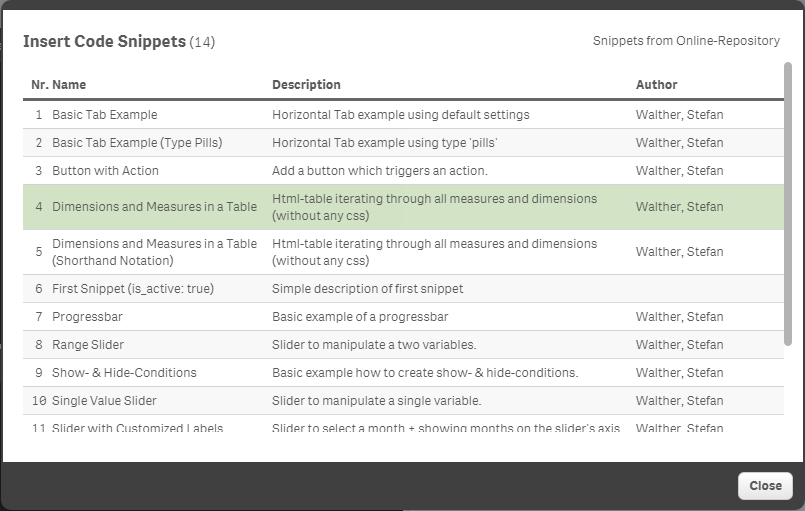

## Introduction

The basic idea behind qWidget is that you should be able to create **new visualizations without the need for programming in JavaScript** by leveraging Qlik Sense' extension concept. By just using HTML & CSS you can create completely new and astonishing objects in Qlik Sense which behave like all other objects and even more:

Visualizations built with qWidget can be

* Created by just copying HTML & CSS from one of the thousands of libraries out there ...
* Copied from one app to another app
* Added to the master library and re-used from there
* Used in Story Telling
* Used across apps and even installations of Qlik Sense
* and more ...

## Installation
Installation of qWidget is straightforward since qWidget is "just" an extension:

* [Download the extension](http://bit.ly/qWidget-Download)
	* Unzip the .zip file
* Extract the content of the .zip-file to the folder folder `...\Users\[UserName]\Documents\Qlik\Sense\Extensions\qWidget\`
* (In some cases it is necessary to close and re-open the Qlik Sense client)
* You should now see a new object/item in the list of objects under "Charts" called "qWidget"  

## Create a new qWidget
If you want to create a new qWidget, just drag and drop it from the list of available Charts.
Configuration of Dimensions and Measures works exactly the same as for any other object type.

Note that in the list of properties there are some qWidget specific properties in the "Appearance" section:
- qWidget Variables

## Areas
There are three main areas in qWidget extensions:
- The "Normal View" when qWidgets are just rendered
- The "qWidget Editor"
- The "qWidget Loader"

## The qWidget Editor
If you hover over a newly added qWidget object an edit icon will be shown. Click on this icon and the edit mode of the qWidget extension will be opened:

> 

As soon as you click on the icon you'll see the qWidget-Editor:

> 

There are several areas in the Widget Editor:

1. **Html-Editor**  
Enter your Html code here
2. **CSS-/Less-Editor**  
Enter your CSS-/Less code here
3. **Live Preview**  
Displays immediately the live preview of your qWidget.

> 

### Variables

You can either insert variables manually or use the "Variable Inserter" tool:

Click on the following button to open the tool:

> 

Then the following window will appear which displays all variables you can use in the current object:

> 

More detailed information on how to use variables and how data-binding works in qWidget can be found in the section "Documentation - Data Binding".

### Code Snippets

Looking for a specific code-snippet?
Just open the "Code Snippets" window and insert a specific snippet at the current cursor position:

Button to open the Code Snippet dialog:

> 

Then you'll see the following dialog:

> 
 

**Auto-Update Snippets:**  
If you are connected to the Internet and therefore to the qWidget-Repository the list of snippets will be updated automatically.

### Icons
If you want to use icons in your qWidget use the "Icons" button to open the dialog which helps you to insert an icon:

### Using the qWidgets
If you want to apply what you have done, click on the "Apply Visualization" button, otherwise just close the editor with the "X Close qWidget" at the top right corner.

### Publishing
If you are connected to the Internet you can publish your qWidget to the qWidget-Repository:

> 

## The qWidget Loader

The qWidget-Loader connects you to the qWidget Repository, which is a central repository of assets for the qWidget extension.

Leveraging the qWidget Repository allows you to:
* Load new visualizations (with code) from an app-independent repository
* Publish your qWidgets for later usage
* Share qWidgets with colleagues
* Load the latest Code-snippets 
* and much more ...

### Open the qWidget Loader

Click on "Load Widget" in the top menu and the qWidget Loader will appear.

> 

By default you'll see some qWidgets from your local qWidget Repository. This local repository is delivered as a part of the qWidget extension.

### How to use the qWidget Loader
As soon as you click on "**Preview**" you'll see a preview of the qWidget in the right pane. If you then click "Download Visualization" the underlying HTML & CSS-/Less-code will be applied to the Widget Editor (you are then not connected anymore to the online repository).

> 

### Connecting to the Online-Repository
If you change the repository to "Limited Public Beta Repository (ONLINE)" you'll see that the list of qWidgets will be updated:

> 

## qWidget Extension Updates
qWidget will automatically check if there are updates available and display the following indicator in the bottom right corner if there is a newer version available:

Click on it and you'll get some information about the new version available.

