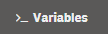
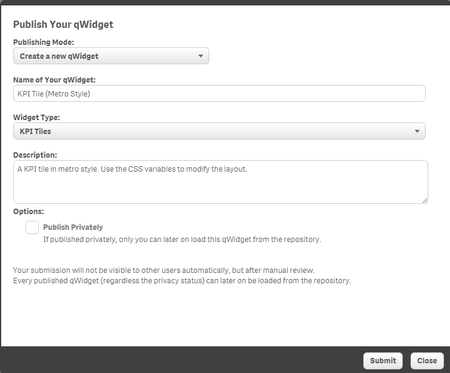
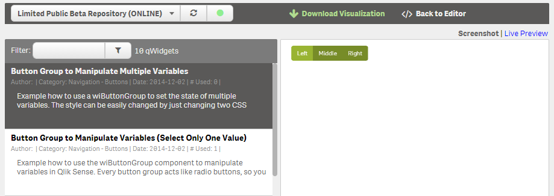

## Introduction

The basic idea behind qWidgets is that you should be able to create **new visualizations without the need of programming them in JavaScript** by leveraging Qlik Sense' extension concept. By just using Html & CSS you can create completely new and astonishing objects in Qlik Sense which behave like all other objects and even more:

qWidgets can be

* Created by just copying Html & CSS from one of the thousands libraries out there ...
* Copied from one app to another app
* Put and to master-library and re-used from there
* Used in Stories
* Used accross apps and even installations of Qlik Sense
* and more ...

## Installation
Installation of qWidget is straightforward since qWidget is "just" an extension:

* [Download the extension](http://bit.ly/qWidgetDL)
	* Unzip the .zip file
* Copy the .zip-file below the folder `...\Users\[UserName]\Documents\Qlik\Sense\Extensions`
* (In some cases it is necessary to close and re-open the Qlik Sense client)
* If you are in edit-mode you should see in the list of objects now a new object called "qWidget"
  

## Create a new qWidget
If you want to create a new qWidget, just drag and drop it from the list of available Charts.
Configuration of Dimensions and Measures works exactly the same as for any other object-type.

Note that in the list of properties there are some qWidget specific properties in the "Appearance" section:
- General qWidget Properties
- qWidget Color Properties

## Areas
There are three main areas in qWidget extensions:
- The normal view when qWidgets are just rendered
- The "qWidget Editor"
- The "qWidget Loader"

## The qWidget-Editor
If you hover over a newly added qWidget object and edit icon will be shown. Click on this icon and the edit mode of the qWidget-extension will be opened:

As soon as you click on the icon you'll see the qWidget-Editor:

There are several areas in the Widget Editor:

1. **Html-Editor**  
Enter your Html code here
2. **CSS-/Less-Editor**  
Enter your CSS-/Less code here
3. **Live Preview**  
Displays immediately the live preview of your qWidget.

### Variables

You can either insert variables manually or use the "Variable Inserter" tool:

Click on the following button to open the tool:

Then the following window will appear which displays all variables you can use in the current object:

More detailed information on how to use variables and how databinding works in qWidget can be found in the section "Documentation - Data Binding".

### Code Snippets

Looking for a specific code-snippet?
Just open the "Code Snippets" window and insert a specific snippet at the current cursor position:

**Auto-Update Snippets:**  
If you are connected to the Qlik-Intranet and therefore to the qWidget-Repository the list of snippets will be updated automatically.

### Icons
If you want to use icons in your qWidget use the "Icons" button to open the dialog which helps you to insert an icon:

### Saving qWidgets
If you want to save what you have done, click on the "Apply qWidget" button, otherwise just close the editor with the "X" at the top right corner.

### Publishing
If you are connected to the Qlik-Intranet (directly or via VPN) you can publish your qWidget to the qWidget-Repository:

### Exporting
At any time you can export your qWidget using the "Export-Tool":

## The qWidget-Loader

The qWidget-Loader connects you to the qWidget Repository, which is a central repository of assets for the qWidget extension.

Leveraging the qWidget Repository allows you to
* Load new visualizations (with code) from an app-independent repository
* Publish your qWidgets for later usage
* Share qWidgets with colleagues
* Bookmark those qWidgets you most like
* Load the latest Code-snippets 
* and much more ...

### Open the qWidget-Loader

Click on "Load Widget" in the top menu and the Widget Loader will appear.

Note: If you see a badge with a number in the "Load Widget" button this will indicate that there are new qWidgets available in the **Online** qWidget-Repository.

By default you'll see some qWidgets from your local qWidget-Repository. This local repository is delivered as a part of the qWidget extension.

### How to use the qWidget-Loader
As soon as you click on "**Preview**" you'll see a preview of the qWidget in the right pane. If you then click "Use qWidget" the underlaying Html & Css-/Less-code will be applied to the Widget-Editor (you are then not connected anymore to the online repository).

### Connecting to the Online-Repository
If you change the repository to Qlik Internal Repository (and if you are working in the Qlik intranet-zone) you'll see that the list of qWidgets will be updated:

## qWidget Extension Updates
If you are connected to the Qlik-intranet (either directly or via VPN) the extension will automatically check if there are updates available and display the following indicator if there is a newer version available:

