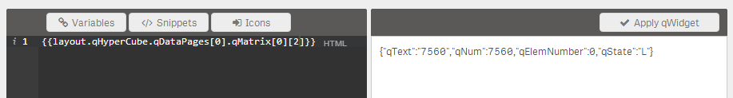
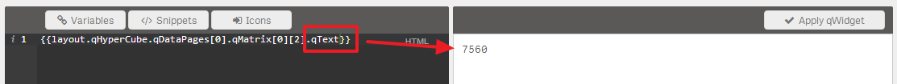
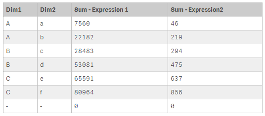
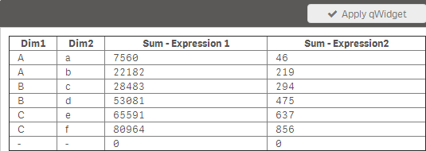
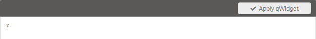
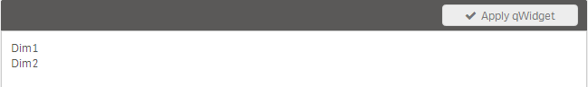
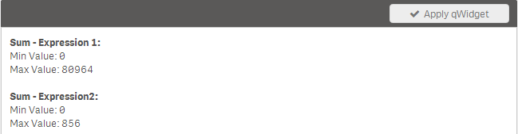
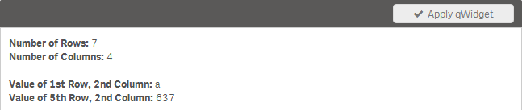
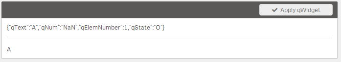

## Introduction
If you are defining **Measures and Dimensions** in your qWidget object (like in any other Qlik Sense object) the result is an internal **data table** exposed to the object.
This data table can and should certainly be used in qWidgets.
There are two ways how you can bind your Html code to the internal data table of your object:

* The **default way**, accessing the so called HyperCube (which is the internal data table mentioned above) directly as also an Extension developer would do
* The (more convenient) way of using the **shorthand notation** provided by qWidget which makes is less complex to work with data

### Which Variant Should I Choose?
It's absolutely dependent on you, there is (nearly) no performance impact.

## The Default Way
If you are choosing the default way you should be aware of some of the basic objects exposed to the current scope of your qWidget and how you can use them:

| Object												| Description
| -----------------------------------------------------	| ---------------------------------------------
| **`layout.qHyperCube`**								| Returns the representation of the **HyperCube** (data table exposed to your qWidget)
| **`layout.qHyperCube.qDimensionInfo`** 				| Get the object array of defined **dimensions**
| **`layout.qHyperCube.qMeasureInfo`**					| Get the object array of defined **measures**
| **`layout.qHyperCube.qDataPages[0].qMatrix`**			| Get the object array of the **data table**
| **`layout.qHyperCube.qDataPages[0].qMatrix[0]`** 		|Get the object array of the **first row**
| **`layout.qHyperCube.qDataPages[0].qMatrix[0][0]`** 	| Get the object array of the **first column in the first row**

### How to Learn this Stuff?
The easiest way to get confident with Qlik Sense' internal representation of the data is to let qWidget let do the work:

***Example:***
Just enter {{safe "{{layout.qHyperCube.qDataPage[0].qMatrix[0][0]}}" }} into qWidget's Html-Editor and you will see the following result in the Live-Preview:

This tells us that for the **1st row" and **3rd** columns we have the following properties available:
* `qText`: The text representation of the cell's value
* `qNum`: The numeric representation of the cell's value

By knowing this now we can change the binding a little bit if we want to use the text representation in our qWidget:

### Default Way Examples
All the examples are based on the following dimensions and expressions defined for your qWidet (based on the default demo script, generated by `Ctrl+0+0` in the Script Editor)

***Dimensions:***
* `Dim1`
* `Dim2`

***Expressions:***
* `Sum(Expression1)`
* `Sum(Expression2)`

So the data table passed to qWidget looks as follows:

#### Iterating Through All Dimensions and Tables

***Html Code:***

	<table border="1">
	  <thead>
	    <tr>
	      <th ng-repeat="dim in layout.qHyperCube.qDimensionInfo">{{safe "{{dim.qFallbackTitle}}"}}</td>
	      <th ng-repeat="mea in layout.qHyperCube.qMeasureInfo" ng-bind="mea.qFallbackTitle"></td>
	    </tr>
	  </thead>
	  <tbody>
	    <tr ng-repeat="row in layout.qHyperCube.qDataPages[0].qMatrix">
	      <td ng-repeat="col in row">
	        {{safe "{{col.qText}}"}}
	      </td>
	    </tr>
	  </tbody>
	</table>

***Result:***

#### Getting then Amount of Rows

***Html Code:***

	{{safe "{{layout.qHyperCube.qDataPages[0].qMatrix.length}}" }}

***Result:***

#### Getting Headers

***Html:***

	

	    {{safe "{{row.qFallbackTitle}}"}}
	

***Result:***

#### Accessing Column Definitions

***Html:***

	

	    <b>{{safe "{{row.qFallbackTitle}}"}}:</b> 
	    Min Value: {{safe "{{row.qMin}}"}} 
	    Max Value: {{safe "{{row.qMax}}"}}  
	

***Result:***

#### Accessing Cells

***Html:***

	<b>Number of Rows:</b> {{safe "{{layout.qHyperCube.qDataPages[0].qMatrix.length}}" }} 
	<b>Number of Columns:</b> {{safe "{{layout.qHyperCube.qDataPages[0].qMatrix[0].length}}" }}  
	
	<b>Value of 1st Row, 2nd Column:</b> {{safe "{{layout.qHyperCube.qDataPages[0].qMatrix[0][1].qText}}" }} 
	<b>Value of 5th Row, 2nd Column:</b> {{ safe "{{layout.qHyperCube.qDataPages[0].qMatrix[4][3].qText}}"}}

***Result:***

## Shorthand - Notation
Since using the above described notation is quite erroneous, qWidget offers a shorthand notation to achieve the same result:

| Method 								| Description
| :-----------------------------------	| ------------------------------------------------------------  
| `wi.header(columnIndex)`				| Retrieve a header-cell of the current Hypercube.  **Parameters:** `columnIndex` - zero based column index of the desired header-cell  **Returns:**  Either information about the dimension ([NxDimensionInfo](http://betahelp.qliktech.com/0.90/en-US/portal/index.html#../Subsystems/QlikView_Client_Protocol_API/Content/GenericObject/LayoutLevel/Hypercube.htm)) or measure ([NxMeasureInfo](http://betahelp.qliktech.com/0.90/en-US/portal/index.html#../Subsystems/QlikView_Client_Protocol_API/Content/GenericObject/LayoutLevel/Hypercube.htm))
| `wi.rows()`							| **Returns** an array of row-objects.
|`wi.colHeaders()`						| **Returns** an array of header-objects (both dimensions and measures).
| `wi.row(rowIndex)`					| Retrieve the row of the current Hypercube.   **Parameters:**  rowIndex - zero based index of the desired row.  **Returns:** Returns a row object.
| `wi.cell(rowIndex, columnIndex)`		| Retrieve a cell of the current Hypercube.   **Parameters:**  `rowIndex` - zero based row index of the desired cell  `columnIndex`: zero based column index of the desired cell  **Returns:** A cell of the current Hypercube ([NxCell](http://betahelp.qliktech.com/0.90/en-US/portal/index.html#../Subsystems/QlikView_Client_Protocol_API/Content/GenericObject/LayoutLevel/Hypercube.htm))  		
| `wi.tableEmpty()`						| **Returns** true if the current HyperCube is empty, otherwise false.
| `wi.rowCount()`						| **Returns** the number of rows in the current HyperCube, if the HyperCube is not defined, `-1` will be returned.
| `wi.colCount()`						| **Returns** the number of columns in the current HyperCube, if the HyperCube is not defined, `-1` is returned.
### Tipps and Tricks Working with the Shorthand Notation

There is no need to read the above mentionend online documentation in detail when you are trying to find specific properties of a cell or a header.

Just output (during development) the returned object of the above mentioned methods and you will immediately see all the available properties in the Preview-Pane:

***Html:***

	<!-- Get all available properties for cell(0,0) -->
	{{safe "{{wi.cell(0,0)}}"}}	
	

	
	<!-- 
	Now we know that the property "qText" returns the 
	text-representation of the cell 
	-->
	{{safe "{{wi.cell(0,0).qText}}"}}

***Result:***

### Examples with the Shorthand Notation

#### Basic Calls

***Data:***
The typical sample-dataset (Ctrl+0+0) is assumed.  
*Dimension:* `Dim1`  

***Html:***

	

	<b>Retrieve a cell and its text:</b> 
	{{safe "{{wi.cell(0,0).qText}}"}}
	
	

	<b>Retrieve a row:</b> 
	{{safe "{{wi.row(0)}}"}}
	
	

	<b>Row count:</b> 
	{{safe "{{wi.rowCount()}}"}}
	
	

	<b>Column count:</b> 
	{{safe "{{wi.colCount()}}"}}
	
	

	<b>Table Empty:</b> 
	{{safe "{{wi.tableEmpty()}}"}}
	
	

	<b>Iterating through rows:</b>
	

	    {{safe "{{row[0].qText}}"}}
	

***Result:***

#### Iterating through Dimensions & Measures

	<table border="1">
	    <thead>
	        <tr>
	            <th ng-repeat="header in wi.colHeaders()">
	                {{safe "{{header.qFallbackTitle}}"}}
	            </th>
	        </tr>
	    </thead>
	    <tbody>
	        <tr ng-repeat="row in wi.rows()">
	            <td ng-repeat="col in row">
	                {{safe "{{col.qText}}"}}
	            </td>
	        </tr>
	    </tbody>
	</table>
