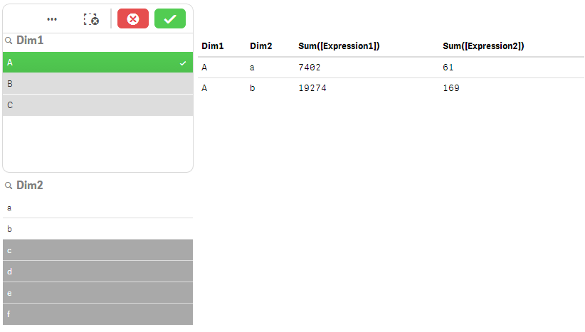

Let's assume you have created a table in qWidget:

***Data Used:***
* Just based on the sample data script using Ctrl+0+0 in the Data Load Editor
* Added `Dim1`, `Dim2`, `Sum(Expression1)` and `Sum(Expression2)`

***HTML:***
(inserted by using one of the existing snippets)

	<wi-bootstrap>
	    <table class="table table-condensed">
	        <thead>
	            <tr>
	                <th ng-repeat="header in wi.colHeaders()">
	                    {{safe "{{header.qFallbackTitle}}"}}
	                </th>
	            </tr>
	        </thead>
	        <tbody>
	            <tr ng-repeat="row in wi.rows()">
	                <td ng-repeat="col in row">
	                    {{safe "{{col.qText}}"}}
	                </td>
	            </tr>
	        </tbody>
	    </table>
	</wi-bootstrap>

***Output:***
> 

## New Requirements

Let's say you now want - for whatever reasons - only display the table if the user has selected at least one of the values in dimension `Dim1`.

For implementing that, just first create a property in the property panel with this condition:

> 

This expression either returns `0 (false)` or `-1 (true)`.

Then add the `ng-if` directive to the table:

	<!-- Display table only if "GetSelectedCount(Dim1)>1" returns true.
	<table ng-if="layout.property1 === '-1'" ...>
		...
	</table>

Finally let's implement the opposite to display a message if the show condition is not true.

	<!-- Display only if "GetSelectedCount(Dim1)>1" returns false
	

		Please select at least one value in dimension Dim1.
	

## The Final Result

***Result in case of no selections in `Dim1`:***

> 

***Result if at least one value is selected in `Dim1`:***

> 

***Final Code:***

	<wi-bootstrap>
	    <table ng-if="layout.property1 != '0'" class="table table-condensed">
	        <thead>
	            <tr>
	                <th ng-repeat="header in wi.colHeaders()">
	                    {{safe "{{header.qFallbackTitle}}"}}
	                </th>
	            </tr>
	        </thead>
	        <tbody>
	            <tr ng-repeat="row in wi.rows()">
	                <td ng-repeat="col in row">
	                    {{safe "{{col.qText}}"}}
	                </td>
	            </tr>
	        </tbody>
	    </table>
	    

	        Please select at least one value in dimension Dim1.
	    

	</wi-bootstrap>

## Further Information
If you want to know more about the `ng-if` directive of AngularJS, here are some resources:

* [ng-if on AngularJS.org](https://docs.angularjs.org/api/ng/directive/ngIf)

Instead of `ng-if` you could have also used `ng-show` and `ng-hide`:
* [ng-show on AngularJS.org](https://docs.angularjs.org/api/ng/directive/ngShow)
* [ng-hide on angularJS.org](https://docs.angularjs.org/api/ng/directive/ngHide)
* [Difference between ng-if and ng-show/ng-hide](http://stackoverflow.com/questions/19177732/what-is-the-difference-between-ng-if-and-ng-show-ng-hide)
