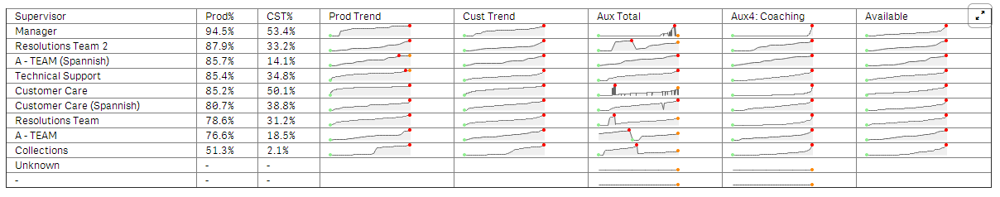

This article describes how to implement `wiMiniChart` in your qWidget tables.

The basic syntax for the `wiMiniChart` is as follows.

	<wi-minichart  
		type="line"  
		data="10,66,13,58"  
		width="100px" />  
	</wi-minichart>

Here are some additional properties that you can use to dress up the chart.

	fill-color="#efefef"  
	line-color="#666"  
	min-spot-color="lightgreen"  
	max-spot-color="red"  
	spot-radius="2"  

Insert the chart in the `<td>` element of a table like so.

	<table border="1">  
		<thead> 
			<tr>
				<th ng-repeat="header in wi.colHeaders()">
					{{safe "{{header.qFallbackTitle}}"}}
				</th>
			</tr>
		</thead>
	<tbody>
		<tr ng-repeat="row in wi.rows()">
			<td ng-repeat="col in row">
				{{safe "{{col.qText}}"}}
			</td>
			<td>
				<wi-minichart  
					type="line"  
					data="10,66,13,58"  
					width="100px">
				</wi-minichart>
			</td>
		</tr>
	</tbody>
	</table>
    
Notice in this example that the data property uses a comma delimited list of data points.  So, our task is to use the hyper cube to build a comma delimited list of data from the QIX engine.  To solve this we need to use the `aggr()` and `concat()` functions.  
The `aggr()` function creates a “table” in the expression that is grouped by some dimensions.  The `concat()` function will then take those table elements and convert them in to the comma delimited list.  

Here is an example:

    concat(aggr(round((sum([Staffed Time])-sum([AUX Time])) 
	/
	sum([Staffed Time]),0.01), Supervisor, Dly_Date),',')
    
in addition we used the round() to tidy up the numbers since in this case we are using a % value.

The finished minichart should look like this

	<wi-minichart
		type="line"
		data="{{safe "{{row[3].qText}}"}}"
		fill-color="#efefef"
		line-color="#666"
		min-spot-color="lightgreen"
		max-spot-color="red"
		spot-radius="2"
		width="100px">
	</wi-minichart>

## Conclusion  
The easiest way to implement the chart is to copy and paste the code above and create an expression in the form of: `concat(aggr(expression, dim1,dim2),’,’)`.  
Lastly, reference the correct column `data="{{safe "{{row[colnum].qText}}"}}"` and bobs your uncle.