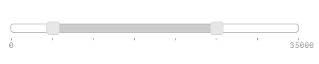
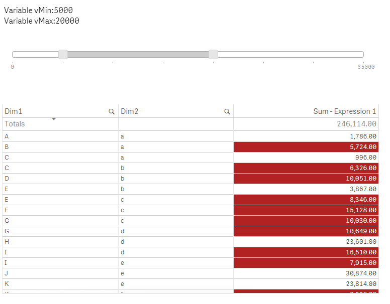
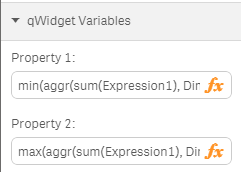

Let's say you have a table in Qlik Sense with some data in it.

Now you would like to give the user the possibility to highlight measures depending on criteria the user can define.

> 

## The Slider Component

To achieve that you can add the slider component which allows the user to manipulate either one or two variables.
But before doing that, please go back to the *Data Load Editor* and create two variables:

    SET vMin = 0;
    SET vMax = 0;
    
To add the slider component, create a new widget above the table.
Then add the slider component, either by pasting the below listed code or by inserting one of the slider snippets in qWidget:

	<wi-slider
	    min="0"
	    max="100"
	    step="10"
	    range="true"
	    bind-qs-var-min="vMin"
	    bind-qs-var-max="vMax"
	    >
	</wi-slider>

This produces a basic slider, we could not set the limits of the slider manually:

	min="0"
	max="35000"
	step="5000"

> 

If you now change the range in the slider the two variables `vMin` and `vMax` will be updated.

So let's go to the table and add a "Background color expression" to for the measure "Sum(Expression1) (if the result of the measure is within vMin and vMax, return red, otherwise white):

	if(Sum(Expression1) >= vMin and Sum(Expression1) <= vMax, rgb(178,34,34), rgb(255,255,255))

That's it, depending on the selected range, the background-color in the measure column changes:

> 

## Improvement
Instead of hard-coding the minimum and maximum of the range-slider we could even define these value depending on our data.

First define the minimum and maximum in the property panel of qWidget:

	=min(aggr(sum(Expression1), Dim1))
	=min(aggr(sum(Expression1), Dim1))

> 

Then go back to the edit mode of the slider in qWidget and change the declaration of the slider as follows:

	<wi-slider 
	    min="layout.property1" 
	    max="layout.property2" 
	    step="5000" 
	    range="true" 
	    bind-qs-var-min="vMin" 
	    bind-qs-var-max="vMax">
	</wi-slider>

Since the maximum of Sum(Expression1) is 32.500 the slider now has changed the maximum accordingly:

> 

